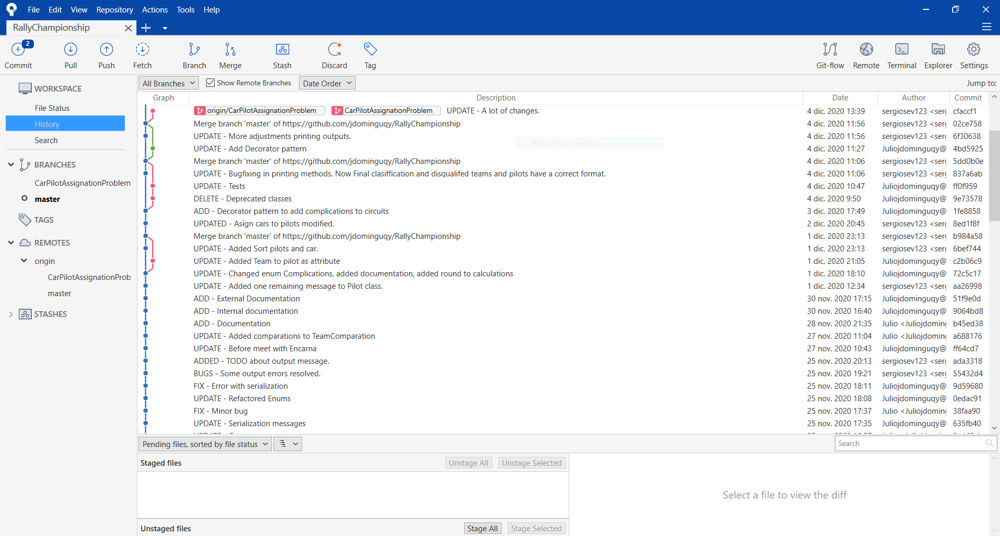
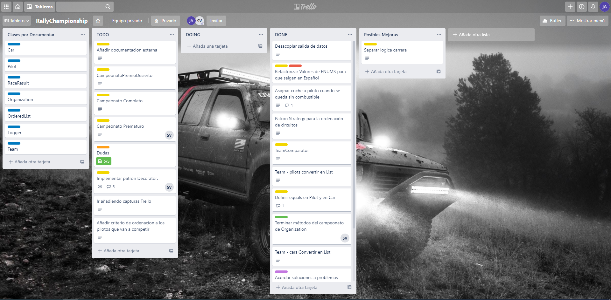

# Miembros del grupo

- Dominguez Arjona, Julio
- Eslava Velasco, Sergio

# Clases para la simulacion

La simulacion está ya preparada mediante las clases "CampeonatoCompletoTest", "CampeonatoPrematuroTest" y "CampeonatoPremioDesiertoTest". Estas clases son tests de JUnit las cuales unicamente hay que ejecutar para hacer una salida completa tanto por pantalla "TODO: Volver a activar el log por pantalla" como a un registro de log en "TODO: Meter ruta donde se guardara el archivo".

Es posible ejecutar cualquiera de las 3 opciones en el orden que se desee, ya que son tests independientes y crean registros de log en distintos sitios.

# Extras

## Pruebas unitarias del proyecto con JUnit (hasta 2 puntos)
Hemos creado clases de tests para los coches, los equipos, los pilotos y circuitos con pruebas unitarias y las 3 ejecuciones posibles que pueden hacerse como tests end to end.

## Aplicación de más patrones de diseño distintos al patrón Singleton indicado en los requisitos mínimos (hasta 2 puntos):

### Singleton

Se han creado 2 singletons. Uno para la Organizacion, la cual debe ser única y aglutinar a todos los equipos de la competicion.

- **Organization:** Implementado por la necesidad de una única instancia que aglutine a todos los equipos y por la necesidad de que cada equipo sea capaz de autoinscribirse a la competición sin necesidad de tener que proveerle una organizacion a la que inscribirse.

- **Logger:** Implementado asi por la inexistencia de procesos en paralelo, lo cual ha hecho proclive la creación de un logger estatico compartido por toda la aplicacion.

### Visitor

- **OutputOperation, Logger, ConsoleOutputOperation, FileOutputOperation:** Implementado para poder flexibilizar la salida del logger de forma dinámica sin interceder con el resto de la aplicación.

### Strategy

- **OrderedList:** Implementado debido a la necesidad de una estructura de datos en forma de lista de longitud dinamica a la cual se le puede cambiar en cualquier momento el criterio de ordenación.

### AbstractFactory

Se han creado 3 factorias abstractas de objetos para facilitar en el apartado de tests la creacion de objetos predefinidos utilizados en las simulaciones.

- **PilotFactory, PilotFactoryImpl**

- **CarFactory, CarFactoryImpl**

- **CircuitFactory, CircuitFactoryImpl**

## Decorator

- **Circuit, CircuitData, CircuitDecorator, ComplicationCold, ComplicationWet, ComplicationNight, ComplicationGravel:** Se ha implementado el patron Decorator para las complicaciones de los circuitos. La interfaz principal es Circuit, de la cual heredan CircuitData y CircuitDecorator. En CircuitData nos encontramos los atributos pertenecientes a un circuito, mientras que CircuitDecorator y sus clases hijas implementan y sobreescriben las funcionalidades de Circuit. CircuitDecorator tiene un atributo del tipo Circuit para añadirle mediante constructor el CircuitData que representa los atributos basicos del circuito, mientras que mediante la "Decoracion" de la clase, se le añaden las complicaciones.

## Uso correcto de Iterator  (hasta 0,5 puntos): 

Usado en la asignacion de coches a los pilotos.

``` java
	public void assignCarsToPilots(int pilotsLimit) {
		Iterator<Pilot> auxPilots = pilots.iterator();
		Iterator<Car> auxCars = cars.iterator();
		while (auxPilots.hasNext() && auxCars.hasNext()) {
			Car car = auxCars.next();
			if (car.hasFuel()) {
				auxPilots.next().setCar(car);
			}
		}
	}
```


## Generación de salida por fichero con  el mismo formato que el utilizado para la salida por defecto por pantalla. (hasta 0,5 puntos).

- **FileOutputOperation:** Visitor utilizado por el Logger utilizado para escribir todos los mensajes de la aplicación en un fichero. La url se provee en el constructor y cuando el Logger inicia la escritura, crea y abre el archivo de destino, escribe los mensajes según se vayan generando y como acción final, cierra el fichero. 

## En el proyecto se habrá hecho un uso correcto y justificado del mecanismo de excepciones (hasta 0,5 puntos)

No hemos hecho uso de excepciones al no haber encontrado un sitio lógico en el que implementarlas.

## Uso de la funcionalidad de Git proporcionada por BlueJ

Se ha hecho uso de un servidor de GitHub para hospedar la aplicacion y compartirla entre 2 equipos.



## Otras herramientas

### Trello

Se ha hecho uso de un tablero Trello (https://trello.com/) para la gestion, organización y coordinación de tareas utilizando una propia adopcion de metodologias ágiles haciendo uso de listas TODO, DOING y DONE junto con etiquetas de TESTING, PRODUCCION, INFOGRAFÍA, BUGS y DOCUMENTACIÓN para tener una vision global del avance del proyecto.



### SourceTree

Se ha hecho uso del gestor de Git SourceTree (https://www.sourcetreeapp.com/) para agilizar el uso de git, moverse entre ramas y facilitar los merges generados por el desarrollo asincrono del proyecto.

### Eclipse

Se ha hecho uso del IDE Eclipse (https://www.eclipse.org/) para un desarrollo mas comodo del proyecto gracias al mayor abanico de herramientas en comparación con BlueJ.
